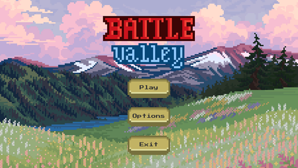
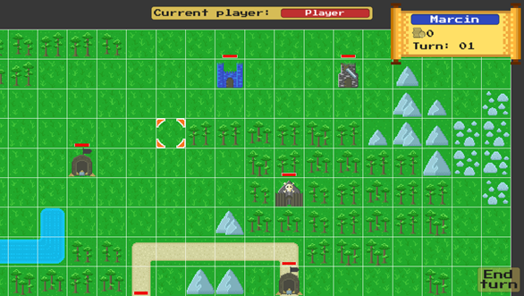
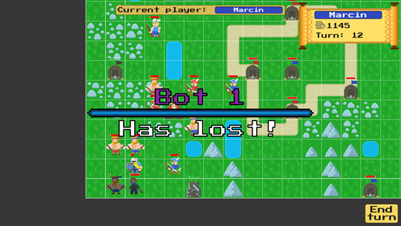
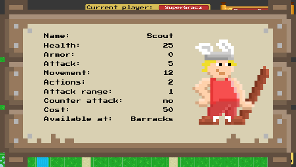
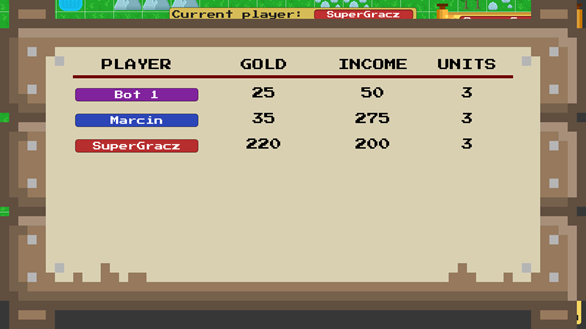
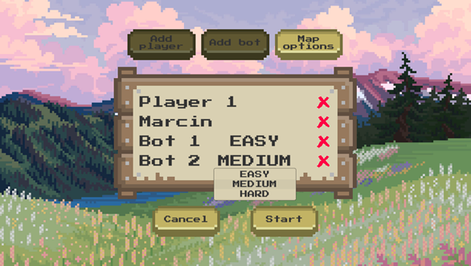
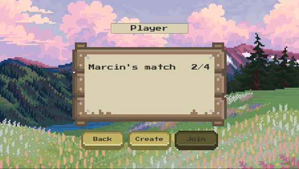
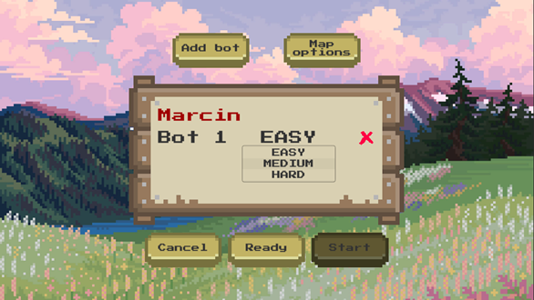

# Battle Valley
Battle Valley is a turn-based strategy game made in Unity. This is a four person project developed as a part of my Engineering Thesis.

## Overview
The game can be played by 2-4 players, including AI bots.
You play on a rectangular grid map. Each player has a Stronghold which needs to be protected. If your Stronghold gets destroyed, you lose. 
Players can recruit units which they use to fight enemy units and capture buildings. 
There are multiple types of units and buildings, each having different stats and functions. 
The goal is to destroy other player's Strongholds. The last player standing wins.

 

 

 

 

## Main features
The game can be played in two modes: local hot-seat and online. Online games are hosted on a dedicated public server.

The game implements a lobby mechanism similar to those found in other multiplayer games.

Players can add bots to lobbies, which can be set to an easy, medium or hard difficulty.

 

 
